# LearnSync AI - Activity Diagram

This document models the end-to-end user activity and system decision workflow for **LearnSync AI**, derived from [`CONTEXT.md`](file:///D:/learnSync/CONTEXT.md) and the system specifications in [`Project/LearnSync_AI_SRS.md`](file:///D:/learnSync/Project/LearnSync_AI_SRS.md) and [`Project/LearnSync_AI_Distributed_System_Paper.md`](file:///D:/learnSync/Project/LearnSync_AI_Distributed_System_Paper.md).

```mermaid
flowchart TD
    %% ==========================================================
    %% START & INGESTION
    %% ==========================================================
    Start([Start Session / Calendar Trigger]) --> IngestEvents[Ingest Course Materials, Calendar & Gmail Deadlines]
    IngestEvents --> ParseSchedule[Docling TableFormer PDF Parsing with Vision-LLM Fallback]
    ParseSchedule --> CreateVFolders[Build Course-Bound Virtual Folder Hierarchy in Supabase]
    CreateVFolders --> ComputeWt[Compute 3-Day Lookahead Workload Score W-t]

    %% ==========================================================
    %% WORKLOAD EVALUATION & HYSTERESIS
    %% ==========================================================
    ComputeWt --> CheckBurnout{Burnout Condition Met?<br/>3+ Deadlines in 48h OR 0 Free Slots in 2 Days}
    
    CheckBurnout -- Yes --> TriggerBurnout[Activate Burnout Guard<br/>Suppress Long Sessions]
    TriggerBurnout --> IssueBMAP[Issue 90-Second B=MAP Micro-Task Prompt]
    IssueBMAP --> StudentBMAP([Student Completes 90s Micro-Task])
    StudentBMAP --> LogTelemetry[Log Trigger & Telemetry to Supabase]

    CheckBurnout -- No --> CheckMode{Evaluate Workload Score W-t}

    CheckMode -- W-t > 0.70 --> SetBusyMode[Enter BUSY MODE]
    CheckMode -- W-t <= 0.55 --> SetFreeMode[Enter FREE MODE]
    CheckMode -- 0.55 < W-t <= 0.70 --> RetainMode[Hysteresis Dead-Band<br/>Retain Current Mode State]

    %% ==========================================================
    %% STUDY PATH GENERATION
    %% ==========================================================
    SetBusyMode --> ConfigureBusy[Configure Busy Mode Parameters:<br/>• Target Retention R_c = 80%<br/>• Interval Expansion = 1.75x<br/>• Pareto 80/20 Core Primitives Filter]
    SetFreeMode --> ConfigureFree[Configure Free Mode Parameters:<br/>• Target Retention R_c = 90%<br/>• Standard FSRS Intervals<br/>• Full Curriculum Scope]
    RetainMode --> FetchContext[Fetch Active Virtual Folder Scope]

    ConfigureBusy --> FetchContext
    ConfigureFree --> FetchContext

    FetchContext --> ExecuteRAG[Execute Grounded RRF Hybrid Search in Supabase<br/>Dense Embedding + BM25 Trigram via match_folder_chunks RPC]
    
    ExecuteRAG --> GenerateArtifact[Generate Adaptive Study Content based on Learning Style]

    %% ==========================================================
    %% MULTIMODAL RENDERING & ACTIVE RECALL
    %% ==========================================================
    GenerateArtifact --> RenderUI[Render Dashboard & Multimodal Study View]
    RenderUI --> ChooseActivity{Student Chooses Activity}

    ChooseActivity -- Flashcard Review --> ReviewDeck[Fetch Due Flashcards for Folder]
    ReviewDeck --> AnswerCard[Student Answers Card & Rates Difficulty]
    
    AnswerCard --> CheckLeech{Card Failures >= 4?}
    CheckLeech -- Yes --> FlagLeech[Flag as Leech & Auto-Pause from Active Queue]
    FlagLeech --> RequestRewrite[Request LLM Simplification]
    RequestRewrite --> UpdateFSRS[Update FSRS Stability, Difficulty & Due Date]
    
    CheckLeech -- No --> UpdateFSRS
    UpdateFSRS --> SaveReviewLog[Persist Review Log to Supabase]

    ChooseActivity -- Feynman Active Recall --> PromptFeynman[Prompt Plain-Language Explanation of Concept]
    PromptFeynman --> SubmitExplanation[Student Explains Concept in Own Words]
    SubmitExplanation --> GapAnalysis[Automated Precision-Gap Analysis vs Source Corpus]
    
    GapAnalysis --> CheckGaps{Knowledge Gaps Found?}
    CheckGaps -- Yes --> SpawnCards[Auto-Generate Targeted Flashcards for Gaps]
    SpawnCards --> DisplayFeedback[Display Precision Feedback & Recommendations]
    CheckGaps -- No --> UpdateMastery[Update Knowledge Component BKT Mastery in Supabase]
    UpdateMastery --> DisplayFeedback

    %% ==========================================================
    %% EDGE FEDERATED TRAINING
    %% ==========================================================
    SaveReviewLog --> OnDeviceTrain[On-Device Local SGD Training on Activity Dwell Time]
    DisplayFeedback --> OnDeviceTrain
    LogTelemetry --> OnDeviceTrain

    OnDeviceTrain --> PerturbGradients[Apply L2 Gradient Clipping & Inject Gaussian Noise DP]
    PerturbGradients --> SendDelta[Send Perturbed Gradient Delta to FedAvg Aggregator]
    SendDelta --> End([End Study Cycle / Await Next Trigger])
```

## Workflow Phases & Key Rules

1. **Ingestion & [Virtual Folder](file:///D:/learnSync/CONTEXT.md#L23-L26) Organization**:
   - Parses syllabi via Docling TableFormer (with Vision-LLM fallback) and synchronizes Google Calendar / Gmail.
2. **Workload Score $W(t)$ & Hysteresis**:
   - Computes continuous 3-day lookahead score $W(t)$.
   - Evaluates **Burnout Guard** ($\ge 3$ deadlines in 48h / 0 free slots in 2 days) to issue 90-second $B=MAP$ micro-tasks.
   - Applies the **Hysteresis Dead-Band** ($0.55 < W(t) \le 0.70$) to prevent rapid toggling between Free Mode and Busy Mode.
3. **Folder-Scoped Hybrid [RAG (RRF)](file:///D:/learnSync/CONTEXT.md#L39-L42)**:
   - Queries candidates restricted to active course folders and computes Reciprocal Rank Fusion within Supabase.
4. **Active Recall & Spaced Repetition**:
   - **Feynman Loop**: Precision-gap analysis maps missing knowledge and constructs targeted flashcards.
   - **Elastic FSRS**: Dynamically adjusts retention targets ($R_c = 80\%$ in Busy Mode) and isolates [Leech](file:///D:/learnSync/CONTEXT.md#L31-L34) cards ($\ge 4$ failures).
5. **[Federated Edge Personalization](file:///D:/learnSync/CONTEXT.md#L43-L46)**:
   - On-device local SGD updates model parameters on private dwell-time data with $(\epsilon, \delta)$-Differential Privacy before central aggregation.
