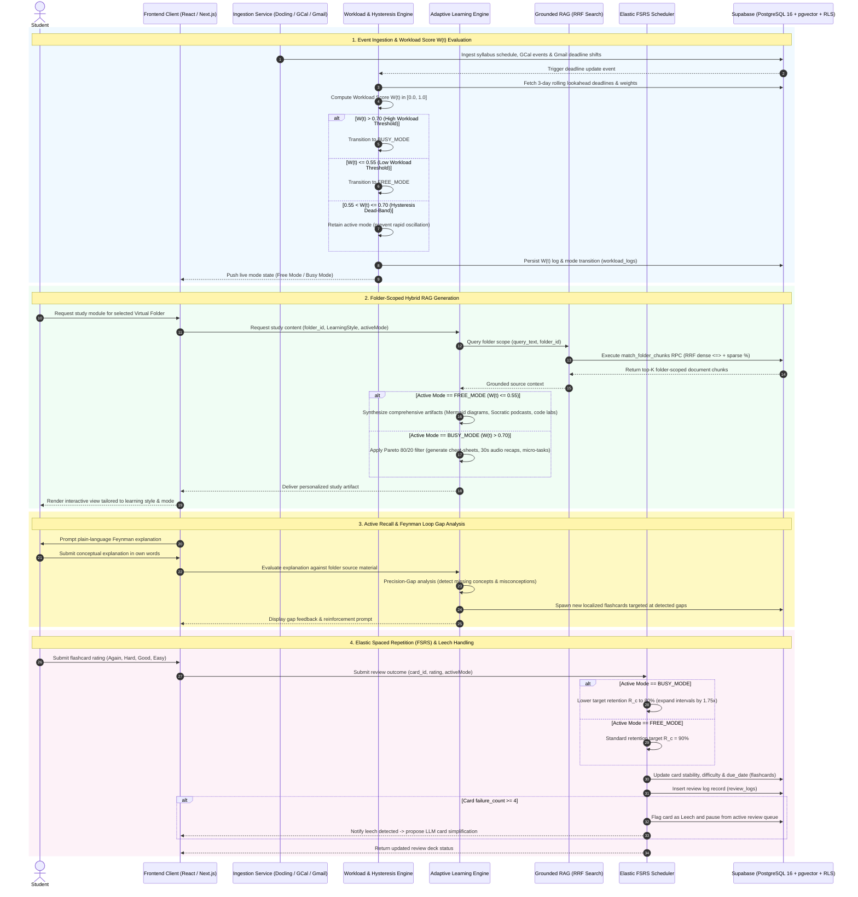

# LearnSync AI - Sequence Diagram

This document models the end-to-end operational sequence of **LearnSync AI**, capturing the interactions across ingestion, workload scoring, grounded hybrid RAG generation, active recall (Feynman Loop), and elastic spaced repetition (FSRS) with **Supabase (PostgreSQL 16 + pgvector + RLS)**.

## Sequence Workflow Analysis

1. **Continuous Workload Evaluation**: When events shift, the [Workload Engine](file:///D:/learnSync/CONTEXT.md#L7-L10) computes $W(t)$ and navigates the [Hysteresis Dead-Band](file:///D:/learnSync/CONTEXT.md#L19-L22) ($0.55 < W(t) \le 0.70$) without jarring transitions.
2. **Folder-Scoped Hybrid [RRF Search](file:///D:/learnSync/CONTEXT.md#L39-L42)**: RAG searches are scoped to the active [Virtual Folder](file:///D:/learnSync/CONTEXT.md#L23-L26), querying Supabase via the `match_folder_chunks` RPC function combining dense cosine similarity (`vector_cosine_ops`) with trigram sparse matching (`pg_trgm`).
3. **The Feynman Active Recall Loop**: Student explanations are compared against the source corpus to identify precision gaps and automatically construct targeted flashcards.
4. **Elastic Spaced Repetition**: Flashcard reviews dynamically scale retention targets and interval multipliers based on active workload modes, automatically pausing chronic failures via [Leech Detection](file:///D:/learnSync/CONTEXT.md#L31-L34).
